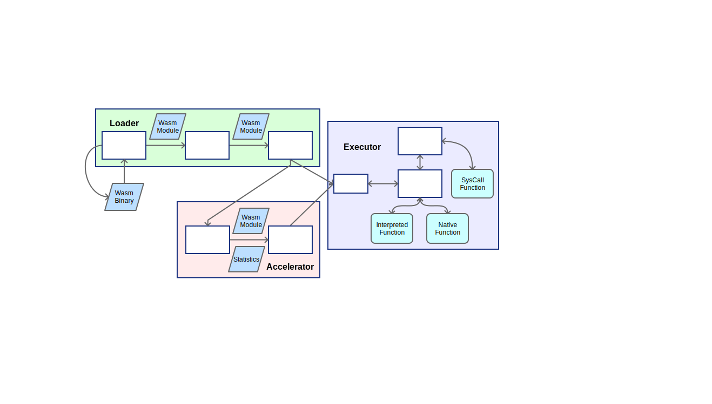

# System Structure

 

WasmVM is built on top of three different components - loader, executor, and accelerator. Each component has different modules executing different tasks. As illustrated above, the larger rectangles with many parts inside represent the individual components, while the smaller white rectangles represent the individual modules.

Data transformation is performed between components and modules, with each data structure being represented by a blue parallelogram.

In the executor component, each function is represented as a light-green rounded rectangle and is categorized into three different category - Native Function, Runtime Function, and Syscall Function.

In the following section, we go through each component of the system structure. For data format, please refer to the [WebAssembly Spec](https://webassembly.github.io/spec/core/index.html).

# Loader

It is inconvenient to manipulate the Wasm bitcode directly in the program, and at the moment it is impossible to execute Wasm bitcode natively on the machine. The job of the loader component is to analyze and format Wasm into a format that programs could better interact with. Then, it validates the Wasm module to be executed and loads it into the executor.

The loader component consists of the following modules:

## Decoder

The purpose of the decoder is to read the Wasm bitcode, analyzing the meaning of each byte, and transforming the bitcode into an easily-operatable Wasm module, and finally passing it on to the validator.

Should the Wasm bitcode format not follow the Wasm spec, the decoder will halt all current decoding tasks and report the error.

## Validator

After the decoder generates a module, the validator validates the Wasm module behaviour according to the validation definition according to the spec.

If the Wasm module behaviour does not follow the Wasm specification, the validator will halt and report the error.

After the validation has been completed, the validator will pass the Wasm module to the instantiator.

## Instantiator

The Wasm module generated by the decoder contains much information used for analysis and validation, but is generally not used for execution.

The instantiator transforms the Wasm module into a Wasm implementation, storing it into the executor Store and passing it to the accelerator analyzer.

# Accelerator

JIT (Just-In-Time compile) occurs when the program is about to be executed or during the execution of the program. It compiles the application into machine code that can be executed natively, accelerating the performance during execution.

The accelerator performs an analysis on the Wasm module, compiling the necessary functions into machine code for best performance.

The accelerator consists of the following modules:

## Analyzer

The analyzer analyzes the frequency traits of each function of the Wasm module, deciding which functions will be JIT compiled into Native Functions, and decide the priority of JIT compilation.

## JIT Compiler

The JIT Compiler compiles the functions used by the Wasm module into Native Functions according to the priority generated by the analyzer and passing the functions to the executor.

# Executor

After the implementation generator has finished processing, the executor executes the inital function within the main module, starting the application.

The executor consists of the following modules:

## Store

The store structure corresponds to the store within the [Wasm specification](https://webassembly.github.io/spec/core/exec/runtime.html#store). It takes the results from the implementation generator, stores it into the corresponding table for later use with the core.

Each running application may utilize multiple Cores, but the storage space will be shared.

## Core

The core is the main execution unit; it has its own [stack](https://webassembly.github.io/spec/core/exec/runtime.html#stack) and program counter.

The core obtains commands based on the program counter, performing the following,

1. Executing Runtime Functions accordingly
2. Triggering SysCall when encountering `unreachable`
3. Calling JIT'd Native Functions

Each running application may utilize multiple cores. Each core has its own stack and program counter, but the storage space will be shared.

## SysCall

Some operations related to system (e.g. input/output) or operations not defined by WebAseembly cannot be executed within WebAssembly.

According to the spec, it is possible to import foreign Native Functions, calling the functions directly for operation; however, WasmVM does not allow calling any foreign Native Functions.

WasmVM must use `unreachable` to trigger a SysCall, then calls the corresponding SysCall function within the SysCall module to handle system calls, issuing operations indirectly - this is similar to a software interrupt.

To execute a SysCall, you must first put in the required value within the stack as index, then put in the corresponding `i32` constant as a SysCall identifer; finally, use the `unreachable` command to trigger a SysCall.

Example:

Let's say we set `0` as the identifier of the SysCall for summation of two integer; in function-form, this is expressed as `add(i32 a, i32 b)`.

Now if we want to assign `a` as `5`, `b` as `3`, and that we want to sum both the variables, we can write the following commands:

```
i32.const 5     ;; i32 a
i32.const 3     ;; i32 b
i32.const 0     ;; identifier
unreachable     ;; execute SysCall
```

After execution, the result `8` will appear in the stack.